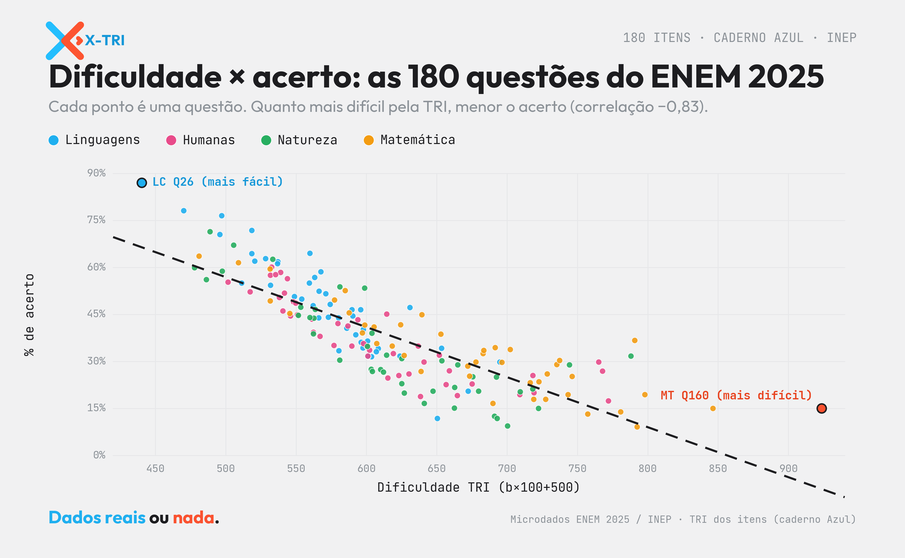

<!-- ===================== SEO / RankMath ===================== -->
**Título SEO (H1):** TRI das questões do ENEM 2025: as 180, da fácil à brutal
**Slug:** tri-das-questoes-do-enem-2025
**Meta description (155):** A TRI das questões do ENEM 2025, item a item: dificuldade, discriminação e % de acerto das 180 questões nos microdados do INEP. Da mais fácil à mais brutal.
**Focus keyphrase:** TRI das questões do ENEM 2025
**Keyphrases secundárias:** dificuldade das questões ENEM 2025 · questão mais difícil do ENEM · parâmetros TRI itens · discriminação Baker · microdados ENEM 2025
**Categoria:** Microdados ENEM · **Tags:** ENEM 2025, TRI, dificuldade, discriminação, microdados, itens
**Imagem destacada:** `xtri_tri_itens_capa.png` (1200×630) — *alt:* "TRI das questões do ENEM 2025: dificuldade das 180 questões por área — XTRI."
<!-- schema Article + FAQPage · author: Xandão (XTRI) · datePublished -->
<!-- ====================================================== -->

# TRI das questões do ENEM 2025: as 180, da fácil à brutal

Qual foi a questão mais difícil do ENEM? E a mais fácil? A **TRI das questões do ENEM 2025** responde com precisão. Usando os [**microdados do ENEM 2025** (INEP)](https://www.gov.br/inep/pt-br/acesso-a-informacao/dados-abertos/microdados/enem), medimos as **180 questões** pela Teoria de Resposta ao Item — dificuldade, discriminação e taxa de acerto — questão por questão, área por área.

*Cada ponto é uma questão: quanto maior a dificuldade TRI, menor o acerto observado (correlação −0,83). Fonte: Microdados ENEM 2025 / INEP, análise XTRI.*

## O que a TRI mede em cada questão

Na TRI das questões do ENEM 2025, três números contam a história de cada item:

- **Dificuldade TRI** (escala `b×100+500`, a mesma da sua nota): quanto maior, mais difícil. 500 é a média da escala.
- **Discriminação** (parâmetro `a`, faixas de Baker): o quanto a questão separa quem sabe de quem não sabe — *muito alta, alta, moderada*.
- **% de acerto observado**: a proporção real de acerto entre os presentes.

## Os extremos na TRI das questões do ENEM 2025

- **A mais brutal de toda a prova:** Matemática **Q160**, dificuldade TRI **923,7** — só **15% de acerto**.
- **A mais fácil:** Linguagens **Q26**, TRI **440,4** — **87% de acerto**.
- **A que mais separa os candidatos:** Natureza **Q120**, discriminação `a = 6,00` (curva quase vertical).
- **Os menores acertos:** MT **Q140 (9,1%)** e CN **Q108 (9,4%)**.
- No geral, **dificuldade e acerto andam juntos ao contrário**: correlação **−0,83** entre TRI e % de acerto.

## TRI das questões de Linguagens e Códigos (Q1 a 45)

Na Linguagens e Códigos, a dificuldade TRI média foi **571,8**. A mais difícil é a **Q17 (694,9, 29,8% de acerto)**; a mais fácil, a **Q26 (440,4, 87,0%)**. Veja as **10 mais difíceis** da área:

| Nº | Dificuldade TRI | Discriminação | % de acerto |
|---|---|---|---|
| 17 | 694,9 | alta | 29,8% |
| 30 | 672,4 | muito alta | 20,5% |
| 40 | 653,5 | alta | 34,2% |
| 32 | 650,5 | muito alta | 11,8% |
| 35 | 631,0 | moderada | 47,2% |
| 8 | 623,9 | muito alta | 31,7% |
| 10 | 608,5 | muito alta | 34,1% |
| 29 | 607,1 | muito alta | 33,1% |
| 9 | 603,7 | muito alta | 31,5% |
| 23 | 601,3 | muito alta | 31,6% |

## TRI das questões de Ciências Humanas (Q46 a 90)

Na Ciências Humanas, a dificuldade TRI média foi **607,0**. A mais difícil é a **Q66 (772,1, 17,4% de acerto)**; a mais fácil, a **Q61 (501,7, 55,3%)**. Veja as **10 mais difíceis** da área:

| Nº | Dificuldade TRI | Discriminação | % de acerto |
|---|---|---|---|
| 66 | 772,1 | muito alta | 17,4% |
| 67 | 767,9 | muito alta | 26,9% |
| 90 | 765,2 | muito alta | 29,8% |
| 79 | 719,2 | muito alta | 20,0% |
| 50 | 718,4 | muito alta | 25,5% |
| 64 | 709,1 | alta | 19,4% |
| 70 | 675,2 | alta | 22,8% |
| 74 | 664,7 | muito alta | 19,1% |
| 83 | 659,0 | moderada | 27,0% |
| 76 | 656,7 | muito alta | 22,6% |

## TRI das questões de Ciências da Natureza (Q91 a 135)

Na Ciências da Natureza, a dificuldade TRI média foi **618,6**. A mais difícil é a **Q119 (788,1, 31,7% de acerto)**; a mais fácil, a **Q100 (477,9, 59,9%)**. Veja as **10 mais difíceis** da área:

| Nº | Dificuldade TRI | Discriminação | % de acerto |
|---|---|---|---|
| 119 | 788,1 | moderada | 31,7% |
| 120 | 744,4 | muito alta | 28,9% |
| 121 | 722,4 | muito alta | 15,0% |
| 124 | 718,3 | muito alta | 21,2% |
| 133 | 709,4 | alta | 20,3% |
| 108 | 700,4 | muito alta | 9,4% |
| 131 | 693,0 | muito alta | 11,8% |
| 117 | 692,5 | muito alta | 25,0% |
| 113 | 691,1 | muito alta | 12,5% |
| 130 | 679,8 | muito alta | 20,5% |

## TRI das questões de Matemática (Q136 a 180)

Na Matemática, a dificuldade TRI média foi **674,3**. A mais difícil é a **Q160 (923,7, 15,0% de acerto)**; a mais fácil, a **Q145 (481,1, 63,6%)**. Veja as **10 mais difíceis** da área:

| Nº | Dificuldade TRI | Discriminação | % de acerto |
|---|---|---|---|
| 160 | 923,7 | moderada | 15,0% |
| 175 | 846,4 | muito alta | 15,0% |
| 144 | 798,0 | alta | 19,4% |
| 140 | 792,5 | muito alta | 9,1% |
| 139 | 790,8 | moderada | 36,7% |
| 178 | 780,8 | muito alta | 13,9% |
| 171 | 757,4 | muito alta | 13,2% |
| 162 | 746,3 | muito alta | 25,2% |
| 153 | 743,4 | muito alta | 19,4% |
| 177 | 737,4 | muito alta | 30,3% |

> A **TRI das questões do ENEM 2025** completa — as 180, item a item — está no carrossel da XTRI e na planilha de dados; aqui destacamos as mais difíceis de cada área.

## Dificuldade × acerto na TRI das questões do ENEM 2025

A correlação entre a dificuldade TRI e o acerto observado é de **−0,83**: quanto mais difícil o item pela TRI, menor o acerto real — exatamente o esperado de uma calibração consistente. Quando os dois discordam (item "fácil" pela TRI com acerto baixo, ou vice-versa), é sinal de um item que se comporta de forma atípica — tema que exploramos em outro estudo. É essa coerência que faz a TRI das questões do ENEM 2025 ser uma régua confiável.

## Perguntas frequentes

**Qual foi a questão mais difícil do ENEM 2025?** Na TRI das questões do ENEM 2025, a campeã é a Q160 de Matemática (dificuldade 923,7 na escala da nota), com apenas 15% de acerto.

**O que é a dificuldade TRI de uma questão?** É o parâmetro `b` do item levado para a escala da nota (`b×100+500`). Quanto maior, mais difícil; 500 é a média.

**O que significa a discriminação de um item?** É o quanto ele separa quem domina de quem não domina o conteúdo (parâmetro `a`, faixas de Baker). Alta discriminação = a questão "pesa" mais na nota TRI.

**Acerto alto significa questão fácil?** Quase sempre — a correlação é −0,83 —, mas não é regra absoluta: discriminação e chute também influenciam.

---

Conhecer a TRI das questões do ENEM 2025 ajuda você a entender onde a prova foi dura — e por que a sua nota é o que é.

*Por Xandão — professor e CEO da XTRI, especialista em ENEM, TRI e análise de microdados. Leia também: [Microdados do ENEM: o guia completo](microdados-do-enem-guia-completo) e [As questões mais chutáveis do ENEM 2025](questoes-mais-chutaveis-do-enem-2025). Fonte: Microdados ENEM 2025 / INEP (caderno Azul).*

*Dados reais ou nada.*