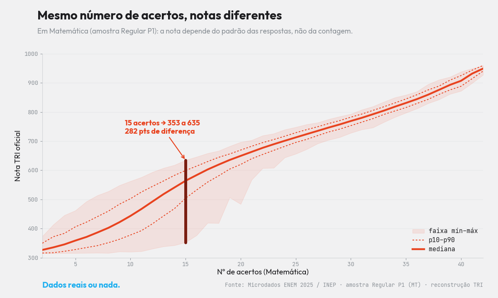

<!-- ===================== SEO / RankMath ===================== -->
**Título SEO (H1):** Como funciona a nota do ENEM 2025: acerto não é nota
**Slug:** como-funciona-a-nota-do-enem
**Meta description (153):** Como funciona a nota do ENEM? Pela TRI, errar a questão difícil custa mais que a fácil — e 15 acertos viram notas de 353 a 635. Veja nos microdados do INEP.
**Focus keyphrase:** como funciona a nota do ENEM
**Keyphrases secundárias:** acerto não é nota · TRI ENEM · discriminação do item · nota TRI ENEM · microdados ENEM 2025
**Categoria:** Microdados ENEM · **Tags:** ENEM 2025, TRI, nota do ENEM, discriminação, microdados
**Imagem destacada:** `xtri_nota_capa.png` (1200×630) — *alt:* "Como funciona a nota do ENEM 2025: mesmo número de acertos, notas diferentes — XTRI."
<!-- schema Article + FAQPage · author: Xandão (XTRI) · datePublished -->
<!-- ====================================================== -->

# Como funciona a nota do ENEM 2025: acerto não é nota

Entender **como funciona a nota do ENEM** é o que separa quem estuda no escuro de quem estuda com estratégia. A nota não é a contagem de acertos: é uma estimativa da sua proficiência feita pela Teoria de Resposta ao Item (TRI). Usando os [**microdados do ENEM 2025** (INEP)](https://www.gov.br/inep/pt-br/acesso-a-informacao/dados-abertos/microdados/enem), dá para provar isso de um jeito que choca: **dois alunos com o mesmo número de acertos podem terminar com notas muito diferentes.**

*Em Matemática, quem fez 15 acertos tirou de 353 a 635 — 282 pontos de diferença. Fonte: Microdados ENEM 2025 / INEP, análise XTRI.*

## "Errei a difícil e perdi mais que quem errou a fácil"

Esse desabafo é real — uma aluna nos escreveu: *"Errei só 1 de Linguagens, a questão 30, e fiquei com nota menor que muita gente que errou só uma considerada mais fácil (questão 14)."* Parece injustiça, mas é a TRI funcionando. Reconstruímos o caso com os parâmetros oficiais da prova:

- Errar **apenas a Q14** (fácil) custou cerca de **20 pontos**.
- Errar **apenas a Q30** (difícil) custou cerca de **39 pontos** — quase o dobro.

## Como funciona a nota do ENEM: a discriminação, não a dificuldade

Aqui está o coração da questão. Cada questão tem um **poder de separar** quem domina de quem não domina o conteúdo: a **discriminação** (parâmetro `a` da TRI). Questões muito discriminativas são "divisoras de águas" — quase todo aluno de bom desempenho acerta. Quando alguém desse nível **erra** uma dessas, o modelo lê isso como um **sinal forte** e desconta mais. A Q14, mesmo "fácil", separa pouco — então errá-la quase não mexe na nota.

Nos dados, o "preço" de errar uma questão tem **correlação de 0,99 com a discriminação** dela e praticamente **zero com a dificuldade**. Ou seja: não é o quão difícil a questão é — é o quanto ela separa os alunos.

## O paradoxo dos 15 acertos

É o mesmo princípio que produz o gráfico acima. Em Matemática, **quem fez 15 acertos terminou com notas de 353 a 635** — **282 pontos** de diferença com o mesmo número de acertos. A nota do ENEM estima a proficiência pelo **padrão** das respostas: acertar 15 questões fáceis e errar as discriminativas não vale o mesmo que acertar 15 questões que realmente separam os candidatos. Esse comportamento, longe de ser um defeito, é validado pelos dados — o modelo de 3 parâmetros prevê o acerto real com correlação de **0,955**.

## Como usar isso a seu favor

Se a discriminação manda na nota, a estratégia muda:

1. **Priorize dominar as questões medianas que mais discriminam** — são as que mais movem a sua nota.
2. **Não persiga só volume de acertos**: 15 acertos "fáceis" rendem menos que 15 acertos consistentes no seu nível.
3. **Construa um padrão coerente**: acertar o que é compatível com o seu nível e não "chutar" aleatoriamente preserva o sinal que a TRI valoriza.

## Perguntas frequentes

**Como funciona a nota do ENEM?** A nota é calculada pela TRI (Teoria de Resposta ao Item): ela estima sua proficiência a partir do **padrão** de acertos e erros, não da simples contagem. Por isso acerto não é nota.

**Por que o mesmo número de acertos dá notas diferentes?** Porque cada questão pesa de forma diferente: acertar questões que discriminam bem sinaliza mais proficiência do que acertar questões fáceis. Em MT, 15 acertos variaram de 353 a 635.

**Errar a questão difícil custa mais?** Pode custar — não pela dificuldade, mas pela **discriminação**. Errar uma "divisora de águas" desconta mais que errar uma questão que separa pouco.

**De onde vêm esses dados?** Dos microdados oficiais do ENEM 2025 (INEP), com a reconstrução da nota pelo modelo TRI de 3 parâmetros (caderno Azul).

---

*Por Xandão — professor e CEO da XTRI, especialista em ENEM, TRI e análise de microdados. Leia também: [Microdados do ENEM: o guia completo](microdados-do-enem-guia-completo), [As questões mais chutáveis do ENEM 2025](questoes-mais-chutaveis-do-enem-2025) e [TRI das questões do ENEM 2025](tri-das-questoes-do-enem-2025). Fonte: Microdados ENEM 2025 / INEP.*

*Dados reais ou nada.*
