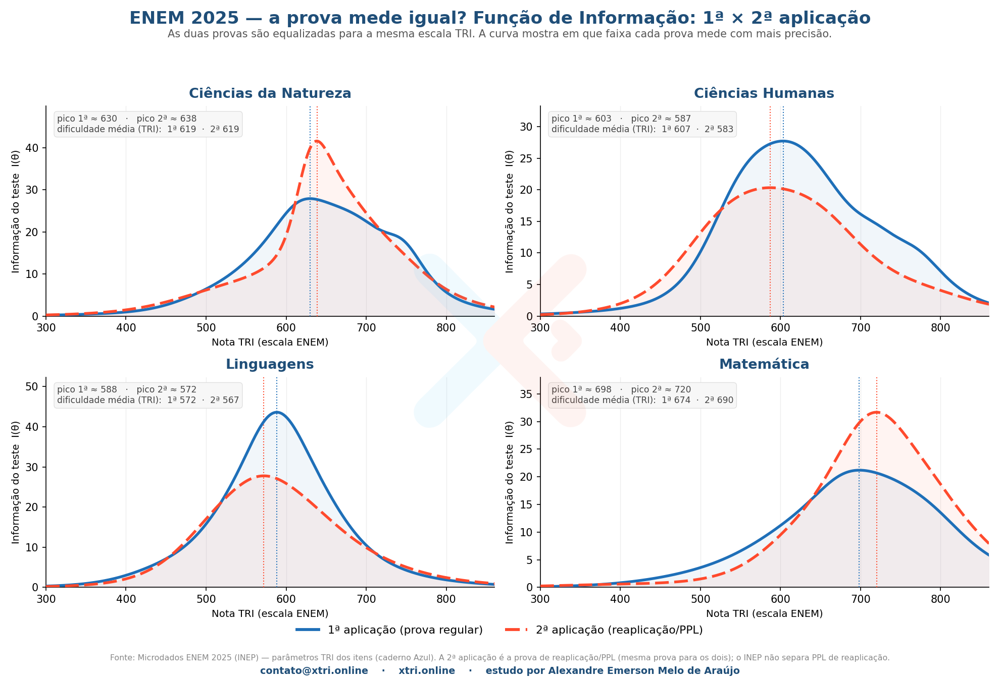

<!-- ===================== SEO / RankMath ===================== -->
**Título SEO (H1):** Reaplicação do ENEM 2025 é mais difícil? A TRI responde
**Slug:** reaplicacao-do-enem-mais-dificil
**Meta description (149):** A reaplicação do ENEM 2025 (2ª aplicação/PPL) é mais difícil que a regular? Veja a função de informação da TRI nos microdados do INEP, área por área.
**Focus keyphrase:** reaplicação do ENEM
**Keyphrases secundárias:** 2ª aplicação do ENEM · função de informação TRI · ENEM PPL · prova de reaplicação ENEM · microdados ENEM 2025
**Categoria:** Microdados ENEM · **Tags:** ENEM 2025, reaplicação, 2ª aplicação, TRI, PPL, função de informação
**Imagem destacada:** `xtri_reaplicacao_capa.png` (1200×630) — *alt:* "Reaplicação do ENEM 2025 é mais difícil? Função de informação da TRI por área — XTRI."
<!-- schema Article + FAQPage · author: Alexandre Emerson Melo de Araújo (XTRI) · datePublished -->
<!-- ====================================================== -->

# Reaplicação do ENEM 2025 é mais difícil? A TRI responde

A **reaplicação do ENEM** — a chamada 2ª aplicação, feita também para Pessoas Privadas de Liberdade (PPL) — gera sempre a mesma dúvida: será que a prova é mais difícil (ou mais fácil) que a regular? Para responder com rigor, fomos aos [**microdados do ENEM 2025** (INEP)](https://www.gov.br/inep/pt-br/acesso-a-informacao/dados-abertos/microdados/enem) e comparamos a **função de informação** das duas provas, pela TRI. A resposta é mais interessante que um simples "sim" ou "não".

*A curva de informação do teste em cada área: 1ª aplicação (azul) × 2ª aplicação / reaplicação do ENEM (vermelha). Fonte: Microdados ENEM 2025 / INEP, estudo XTRI.*

## O que é a função de informação (e por que ela importa)

Na TRI, cada prova tem uma **função de informação**: uma curva que mostra **em que faixa de nota ela "enxerga" melhor**. Onde a curva é mais alta, a prova separa os candidatos com mais precisão; onde é baixa, ela mede com menos nitidez. Como as duas aplicações são **equalizadas para a mesma escala**, dá para sobrepor as curvas e ver, de forma justa, onde cada uma mede melhor — sem depender da nota de ninguém.

## A reaplicação do ENEM mede igual à prova regular?

Não exatamente — e o padrão **muda conforme a área**:

- **Ciências da Natureza:** as duas têm a mesma dificuldade média (TRI 619), mas a **reaplicação do ENEM mede com muito mais precisão** na faixa central — o pico de informação quase dobra (≈ 42 contra ≈ 28), em torno da nota 638.
- **Ciências Humanas:** aqui a 2ª aplicação é um pouco **mais fácil** (pico em 587 vs 603) e mede **pior** — discrimina menos (pico ≈ 20 contra ≈ 28).
- **Linguagens:** a **prova regular é a campeã de precisão** — pico de informação altíssimo (≈ 44), bem acima da reaplicação (≈ 28). É a área em que mais se diferenciam.
- **Matemática:** a reaplicação é **mais difícil** (curva deslocada para cima, pico em 720 vs 698) e mede melhor no **topo** da escala (pico ≈ 32 contra ≈ 21).

## Não existe "mais fácil" nem "mais difícil" em bloco

O grande achado é que **não há um padrão único**. A reaplicação do ENEM não é uniformemente mais fácil nem mais difícil: em Natureza ela mede melhor na mesma faixa; em Matemática puxa para cima; em Humanas afrouxa; em Linguagens perde muita precisão para a regular. Cada prova tem a sua "personalidade psicométrica".

## Por que comparamos a prova, e não as notas (a parte honesta)

Aqui vai a transparência que sustenta a análise. O microdado do INEP **não separa PPL de reaplicação**: a 2ª aplicação é uma prova única para os dois grupos. E o grupo da 2ª aplicação é minúsculo (poucas centenas por área) e, no RESULTADOS, pontua **mais** que a 1ª — sinal de que é dominado por reaplicação, não por PPL. Por isso, montar uma "curva de notas de PPL" seria **inventar uma conclusão que o dado não permite**. O que é honesto e factível é comparar a **curva da prova** (os itens), que independe de quem fez o exame. É exatamente isso que esta análise faz.

## O que isso significa pra você

Se você fez (ou vai fazer) a reaplicação do ENEM, a leitura prática é: **a escala é a mesma**, então a nota é comparável à da aplicação regular. O que muda é **onde cada prova mede melhor** — e isso é característica do conjunto de itens, não um "desconto" ou "bônus" para o participante. A estratégia de prova continua a mesma: garanta as questões do seu nível primeiro.

## Perguntas frequentes

**O que é a reaplicação do ENEM?** É a 2ª aplicação do exame, realizada em datas próprias para quem faltou por motivo justificado e para Pessoas Privadas de Liberdade (PPL). É uma prova diferente da regular, mas na **mesma escala TRI**.

**A reaplicação do ENEM é mais difícil?** Depende da área. Em Matemática a 2ª aplicação de 2025 ficou mais difícil; em Humanas, um pouco mais fácil; em Natureza e Linguagens a diferença está mais na **precisão** do que na dificuldade.

**O que é a função de informação da TRI?** É a curva que mostra em que faixa de nota a prova mede com mais precisão (onde ela melhor diferencia os candidatos).

**A nota da reaplicação vale o mesmo?** Sim. As duas aplicações são equalizadas para a mesma escala, então as notas são comparáveis.

---

*Estudo por **Alexandre Emerson Melo de Araújo** — professor e fundador da XTRI, especialista em ENEM, TRI e análise de microdados. Leia também: [Microdados do ENEM: o guia completo](microdados-do-enem-guia-completo) e [Não faça o ENEM na ordem](nao-faca-enem-na-ordem-ppl-tri). Fonte: Microdados ENEM 2025 / INEP · contato@xtri.online · xtri.online.*

*Dados reais ou nada.*
