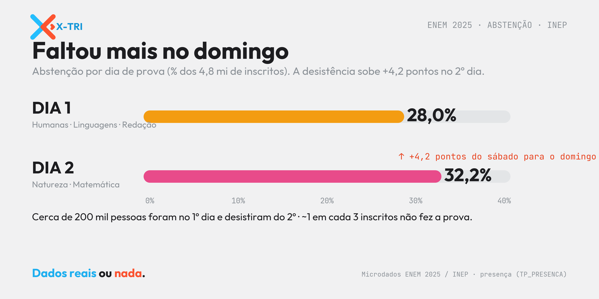

<!-- ===================== SEO / RankMath ===================== -->
**Título SEO (H1):** Abstenção no ENEM 2025: 1 em 3 inscritos não foi
**Slug:** abstencao-no-enem-2025
**Meta description (150):** Abstenção no ENEM 2025: quase 1 em cada 3 inscritos não fez a prova, e a desistência cresce no 2º dia. Veja os números oficiais do INEP, dia a dia.
**Focus keyphrase:** abstenção no ENEM 2025
**Keyphrases secundárias:** abstenção ENEM · desistência ENEM 2025 · faltou ENEM · presença ENEM · microdados ENEM 2025
**Categoria:** Microdados ENEM · **Tags:** ENEM 2025, abstenção, desistência, INEP, microdados
**Imagem destacada:** `xtri_abstencao_capa.png` (1200×630) — *alt:* "Abstenção no ENEM 2025: 1 em 3 inscritos não foi à prova — XTRI."
<!-- schema Article + FAQPage · author: Xandão (XTRI) · datePublished -->
<!-- ====================================================== -->

# Abstenção no ENEM 2025: 1 em 3 inscritos não foi

A **abstenção no ENEM 2025** é um dos dados mais impressionantes da edição: segundo os [**microdados oficiais do INEP**](https://www.gov.br/inep/pt-br/acesso-a-informacao/dados-abertos/microdados/enem), **quase 1 em cada 3 inscritos não compareceu** à prova. Faltar, no ENEM, virou regra — não exceção. E tem um detalhe que quase ninguém comenta: a desistência **cresce do primeiro para o segundo dia**.

*Faltou mais no domingo: 28,0% no dia 1 contra 32,2% no dia 2. Fonte: Microdados ENEM 2025 / INEP, análise XTRI.*

## A abstenção no ENEM 2025 foi maior no 2º dia

A abstenção não foi igual nos dois dias de prova:

- **Dia 1** (Ciências Humanas, Linguagens e Redação): **28,0%** de faltas.
- **Dia 2** (Ciências da Natureza e Matemática): **32,2%** de faltas.

No total, cerca de **1,5 milhão de pessoas faltaram no segundo dia** — de 4,8 milhões de inscritos. A diferença entre os dois dias revela um fenômeno importante: **aproximadamente 200 mil pessoas foram no sábado e desistiram no domingo**. A abstenção sobe **+4,2 pontos percentuais** de um dia para o outro.

## Uma das maiores abstenções do mundo

Para um exame dessa escala, a abstenção está **entre as mais altas do planeta**. Isso não é só estatística: conversa diretamente com **evasão escolar, vulnerabilidade socioeconômica e logística de acesso** — quem mora longe do local de prova, quem precisa trabalhar no fim de semana, quem perdeu o ânimo no meio do caminho. É um indicador que merece a atenção de escolas, gestores e de quem formula política educacional.

## O que isso significa para você (que vai fazer a prova)

Aqui mora a leitura mais poderosa do dado. Se você já se inscreveu, a estratégia é simples e brutalmente eficaz: **vá nos dois dias.** Boa parte da sua concorrência **some pelo caminho** — só de comparecer e terminar a prova, você já passa à frente de milhões de inscritos. Cansou no domingo? Lembre que **entregar a prova vale mais que qualquer simulado**. A abstenção no ENEM 2025 é, ao mesmo tempo, um problema social e uma oportunidade individual: aparecer já é meio caminho andado.

## Perguntas frequentes

**Qual foi a abstenção no ENEM 2025?** Quase 1 em cada 3 inscritos não fez a prova: 28,0% faltaram no dia 1 e 32,2% no dia 2, de um total de 4,8 milhões de inscritos.

**Por que a abstenção é maior no segundo dia?** Cerca de 200 mil pessoas comparecem no primeiro dia e desistem do segundo — cansaço, desânimo após uma prova difícil e logística pesam. A diferença é de +4,2 pontos.

**De onde vêm esses números?** Dos microdados oficiais do ENEM 2025 (INEP), a partir da variável de presença (`TP_PRESENCA`).

**Faltar em um dia zera o ENEM?** Sim para fins de média das áreas daquele dia: quem falta não tem nota na(s) prova(s) do dia. Por isso comparecer aos dois dias é essencial.

---

*Por Xandão — professor e CEO da XTRI, especialista em ENEM, TRI e análise de microdados. Leia também: [Microdados do ENEM: o guia completo](microdados-do-enem-guia-completo) e [A prova cansa: a fadiga no ENEM pelos dados](fadiga-no-enem). Fonte: Microdados ENEM 2025 / INEP (presença, TP_PRESENCA).*

*Dados reais ou nada.*
