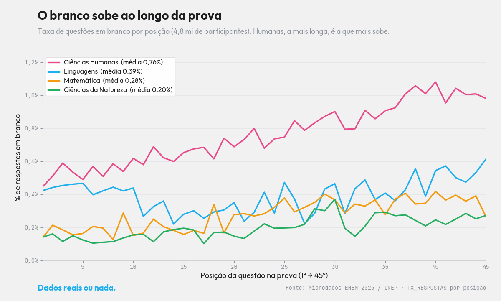

<!-- ===================== SEO / RankMath ===================== -->
**Título SEO (H1):** Questões em branco no ENEM 2025: o branco dobra no fim
**Slug:** questoes-em-branco-no-enem
**Meta description (151):** Questões em branco no ENEM quase dobram até o fim da prova, mostram os microdados do INEP 2025. Veja o que o cansaço revela e a estratégia certa.
**Focus keyphrase:** questões em branco no ENEM
**Keyphrases secundárias:** fadiga no ENEM · deixar em branco ENEM · cansaço na prova ENEM · estratégia de prova ENEM · microdados ENEM 2025
**Categoria:** Microdados ENEM · **Tags:** ENEM 2025, em branco, fadiga, estratégia de prova, microdados
**Imagem destacada:** `xtri_branco_capa.png` (1200×630) — *alt:* "Questões em branco no ENEM 2025 aumentam ao longo da prova, por área — XTRI."
<!-- schema Article + FAQPage · author: Xandão (XTRI) · datePublished -->
<!-- ====================================================== -->

# Questões em branco no ENEM 2025: o branco dobra no fim

Você já sentiu que "apagou" nas últimas questões? Não é só você. As **questões em branco no ENEM** são raras — mas, nos [**microdados do ENEM 2025** (INEP)](https://www.gov.br/inep/pt-br/acesso-a-informacao/dados-abertos/microdados/enem), elas **quase dobram do começo para o fim da prova**. Analisamos o vetor de respostas de **4,8 milhões de participantes**, posição por posição, e o cansaço aparece com clareza.

*A taxa de "em branco" por posição (1ª → 45ª) em cada área. Ciências Humanas, a mais longa de leitura, sobe de ~0,5% para ~1,0%. Fonte: Microdados ENEM 2025 / INEP, análise XTRI.*

## Por que as questões em branco no ENEM são tão raras

Em todas as quatro áreas, a taxa de branco fica **abaixo de 1%**. O motivo é estatístico: no ENEM, **errar não desconta pontos**. Como não há punição pelo erro, deixar a questão vazia nunca compensa — chutar é sempre a melhor escolha. Por isso o branco é tão raro.

## Mas o cansaço aparece: o branco quase dobra

Mesmo raro, o "em branco" **quase dobra** do início para o fim da prova:

- **Matemática:** ×2,1
- **Ciências Humanas:** ×1,9 (de ~0,5% para ~1,0%)
- **Ciências da Natureza:** ×1,9
- **Linguagens:** ×1,2

**Ciências Humanas** — a prova mais longa de leitura, aplicada no fim do primeiro dia — é onde a fadiga mais pesa: a taxa de questões em branco no ENEM sobe de cerca de 0,5% nas primeiras questões para 1,0% nas últimas. Não é falta de conhecimento: é energia acabando.

## A lição para a sua prova

Desempenho no ENEM também é **gestão de energia**. Se o branco cresce com o cansaço, a estratégia é clara: **garanta as questões que você domina enquanto a concentração está no auge** e não deixe pontos fáceis para a fase final, de cabeça pesada. Pequenos ajustes na ordem de resolução — fazer primeiro o que você sabe — podem significar pontos preciosos na nota.

## Perguntas frequentes

**Vale a pena deixar questão em branco no ENEM?** Não. Como erro não desconta, deixar em branco nunca é vantajoso — sempre chute. Por isso as questões em branco no ENEM são tão raras (menos de 1%).

**Por que o branco aumenta no fim da prova?** Por fadiga. A concentração cai ao longo das horas de prova, e nas últimas posições mais gente deixa questões sem responder — o branco quase dobra.

**Qual prova tem mais branco?** Ciências Humanas, a mais longa de leitura e no fim do primeiro dia, com média de 0,76% e pico acima de 1% nas últimas questões.

**De onde vêm esses dados?** Dos microdados oficiais do ENEM 2025 (INEP), contando as respostas em branco por posição no vetor de respostas de 4,8 milhões de participantes.

---

*Por Xandão — professor e CEO da XTRI, especialista em ENEM, TRI e análise de microdados. Leia também: [Microdados do ENEM: o guia completo](microdados-do-enem-guia-completo) e [Como funciona a nota do ENEM](como-funciona-a-nota-do-enem). Fonte: Microdados ENEM 2025 / INEP.*

*Dados reais ou nada.*
