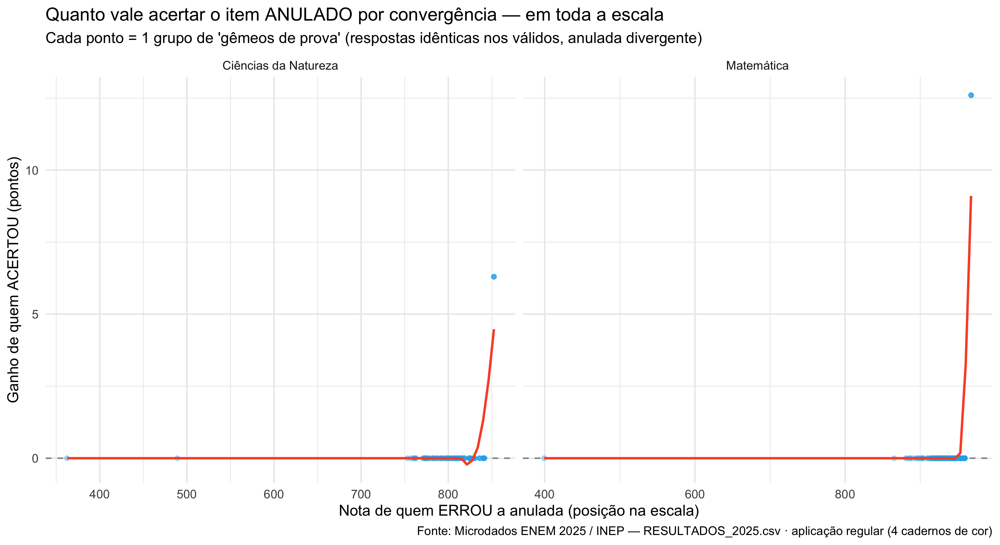
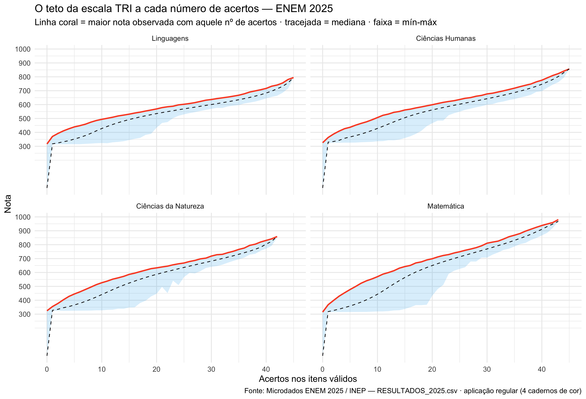

<!-- ===================== SEO / RankMath ===================== -->
**Focus keyphrase:** nota máxima do ENEM 2025

**Prova de ineditismo — frases-foco JÁ usadas nos outros posts (nenhuma colide):**
- questões em branco no ENEM (`posts_fadiga`)
- reaplicação do ENEM (`estudo_curva_prova_1a_2a`)
- ordem das questões no ENEM (`estudo_dificuldade_ppl`)
- como funciona a nota do ENEM (`analise_psicometria_2025`)
- questões mais chutáveis do ENEM (`carrossel_chutadas_2025`)
- TRI das questões do ENEM 2025 (`TRI_dos_itens_post`)
- abstenção no ENEM 2025 (`posts_abstencao`)
- questões anuladas do ENEM 2025 (`post_anulados`)

**Título SEO (H1):** Nota máxima do ENEM 2025: a questão anulada que valeu 12,6 pontos
**Slug:** nota-maxima-do-enem-2025  *(24 caracteres — ≤ 75 ✓)*
**Meta description (139 caracteres):** Nota máxima do ENEM 2025: uma questão anulada valeu 12,6 pontos e decidiu quem fez 980 em Matemática. Veja a prova nos microdados do INEP.
**Keyphrases secundárias:** questão anulada ENEM · 980 em Matemática · gêmeos de prova · teto da TRI · microdados ENEM 2025
**Categoria:** Microdados ENEM · **Tags:** ENEM 2025, nota máxima, questões anuladas, TRI, INEP, microdados, Matemática
**Imagem destacada:** `capa_wp_nota_maxima_1200x630.png` (1200×630, pronta) — *alt:* "Nota máxima do ENEM 2025 decidida por uma questão anulada: 980,3 contra 967,7 — XTRI."
<!-- schema Article + FAQPage · author: Prof. Alexandre Emerson (XTRI) · datePublished -->
<!-- ====================================================== -->

# Nota máxima do ENEM 2025: a questão anulada que valeu 12,6 pontos

A **nota máxima do ENEM 2025** em Matemática foi 980,3 — e ela não foi decidida por nenhuma das 43 questões que valiam nota. Foi decidida por uma questão **anulada**. Eu encontrei a prova nos [microdados oficiais do INEP](https://www.gov.br/inep/pt-br/acesso-a-informacao/dados-abertos/microdados/enem), que cobrem 4,8 milhões de candidatos, e neste post mostro o teste que não deixa margem para dúvida.

Se você acompanhou minha [autópsia das questões anuladas do ENEM 2025](/questoes-anuladas-do-enem-2025/), vai lembrar da questão de Matemática anulada por "problema de convergência" — aquela em que os melhores alunos convergiam numa letra diferente do gabarito. A regra que todo mundo conhece diz: questão anulada não vale nada. Este post responde a pergunta que ficou no ar: a regra se cumpriu?

## O teste dos gêmeos de prova

O método é simples e auditável. Chamo de **gêmeos de prova**: candidatos do mesmo caderno, com respostas idênticas em TODOS os itens válidos, divergindo apenas na questão anulada. Se a anulada não conta para a nota, gêmeos têm que receber exatamente a mesma nota. Sem modelo estatístico, sem regressão — comparação exata, linha a linha, em cima do arquivo público de respostas.

Encontrei 322 grupos de gêmeos na aplicação regular, somando cerca de 2.300 candidatos e cobrindo a escala inteira: da nota 362 até a **nota máxima do ENEM 2025**.

*O ganho de acertar a anulada, grupo a grupo de gêmeos: uma linha plana no zero — até chegar ao topo da escala. Fonte: Microdados ENEM 2025 / INEP, análise XTRI em R.*

O resultado tem duas metades. A primeira é tranquilizadora: em **314 dos 322 grupos**, a diferença de nota entre os gêmeos foi de exatamente 0,0 ponto. Para praticamente toda a escala, a exclusão funcionou como prometido — a anulada não mudou a nota de ninguém.

## Como a nota máxima do ENEM 2025 foi decidida

A segunda metade é a que importa para o topo. Os únicos 8 grupos com diferença de nota foram os padrões perfeitos — e é aí que a **nota máxima do ENEM 2025** entra na história.

Entre os 601 candidatos que acertaram todos os 43 itens válidos de Matemática, quem marcou a letra A na questão anulada ficou com **980,3**. Quem marcou qualquer outra letra ficou com **967,7**. Desempenho idêntico em tudo que oficialmente valia nota, 12,6 pontos de diferença — e foi só isso que separou as maiores notas de Matemática do país. Em Ciências da Natureza, o item anulado da área repetiu o padrão: 858,7 contra 852,4 entre os 84 que gabaritaram os 42 itens válidos.

O controle negativo fecha a lógica: Linguagens e Humanas não tiveram item anulado em 2025 — e lá todos os que gabaritaram empataram (794,5 e 856,4, respectivamente), exatamente como a teoria manda. O padrão só quebra onde existe anulada.

*O teto de cada área a cada número de acertos: a nota máxima do ENEM 2025 em cada prova tem uma régua própria. Fonte: Microdados ENEM 2025 / INEP, análise XTRI em R.*

## O gabarito era a resposta minoritária entre os melhores

O detalhe que fecha o caso: dos 601 melhores de Matemática, apenas **86 marcaram a letra oficial (A)**. Outros 512 marcaram D. O gabarito era a resposta minoritária entre os melhores candidatos do Brasil — sinal claro de que o item estava mesmo quebrado, o que é coerente com a anulação por "problema de convergência" registrada pelo INEP no campo TX_MOTIVO_ABAN. Ou seja: a nota máxima do ENEM 2025 dependeu de um item que a própria estatística da prova reprovou.

Minha leitura técnica — e registro que é interpretação, porque o processamento interno do INEP não é público: o item parece ter permanecido no modelo com parâmetros fraquíssimos. Onde a prova tem informação, o efeito fica abaixo do arredondamento de uma casa decimal; no extremo da escala, onde a informação desaba, o mesmo item vale de 6 a 13 pontos. O que os dados provam é o efeito, não o mecanismo.

Nada disso muda a vida de quem fez 500 ou 700 — provamos diferença zero para essa faixa. Mas num exame em que décimos decidem vaga de Medicina, o topo da escala foi decidido por uma questão oficialmente anulada. Para entender por que a escala se comporta assim, vale revisitar [como funciona a nota do ENEM](/como-funciona-a-nota-do-enem/) e a [TRI das questões do ENEM 2025](/tri-das-questoes-do-enem-2025/).

## Método e reprodutibilidade

Todos os números deste estudo da nota máxima do ENEM 2025 saíram dos microdados públicos do INEP (aplicação regular, 4 cadernos de cor), processados em R com data.table e ggplot2, em scripts numerados e reproduzíveis. Foram 644 comparações de subgrupos de gêmeos, com zero exceções ao padrão descrito: a nota é função pura do padrão de respostas válidas mais a resposta na anulada.

## Perguntas rápidas

**Qual foi a nota máxima do ENEM 2025 em Matemática?**
980,3 — alcançada por 86 candidatos que acertaram os 43 itens válidos E marcaram A na questão anulada. Quem gabaritou tudo que valia, mas marcou outra letra na anulada, ficou com 967,7.

**Questão anulada conta na nota do ENEM?**
Para praticamente todos os candidatos, não — os gêmeos de prova mostram diferença de 0,0 ponto na escala inteira. A exceção comprovada em 2025 está no topo: entre quem acertou todos os itens válidos, a resposta na anulada definiu a nota final.

**Quantas questões foram anuladas no ENEM 2025?**
Seis no total. Este post trata das duas anuladas por "problema de convergência" (uma de Matemática, uma de Ciências da Natureza); o inventário completo está no post de [questões anuladas do ENEM 2025](/questoes-anuladas-do-enem-2025/).

---

No XTRI, é esse o nosso trabalho: transformamos dados em aprovações. [xtri.online](https://xtri.online)
